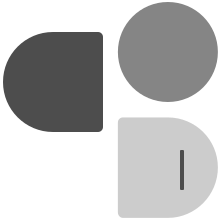

# 关于

## 实验室

建立这个的实验室的初衷是为了让“热爱和兴趣”有个组织。将一群有同样兴趣的人集中在一起，希望大家能在实验室有所收获，在大学这段时间能有所成长！

## 其他

关于实验室的名字，顾名思义和编程有关，这是基础。域名为 `deepcodelab.top` 最后的 `top`  意为“顶流的”、“第一的”，希望在实验室的同学们不断成长、成为自己心中的TOP！

## Logo

logo是 `code` 的含义。三个元素组成 `cod` ,最后的 `e` 则是由竖方向的 `1（e）` 组成，并为一个跳动的光标，表示编码。